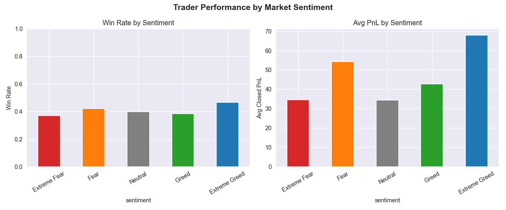
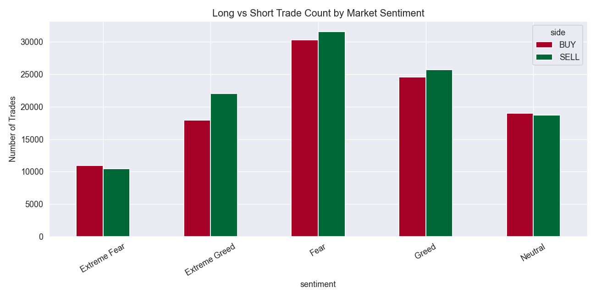
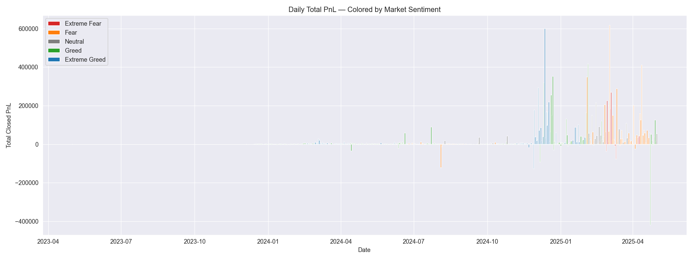

# PrimeTrade Data Science Task: Market Sentiment vs. Trader PnL

This repo contains my submission for the PrimeTrade Data Science assignment. The goal of this task was to see if there's a mathematical connection between the overall mood of the crypto market (Bitcoin Fear & Greed Index) and how well traders actually perform on Hyperliquid. 

### What the data actually showed

I merged the trade data with historical sentiment index data, and a few clear patterns stood out:

* **Momentum is key:** Traders had the highest win rates and the best average profit (PnL) during "Extreme Greed" and "Fear" days. High market momentum creates the best trading setups.
* **Neutral markets are expensive:** Performance tanked during "Extreme Fear" and "Neutral" periods. It looks like stagnant or overly panicked markets just result in unpredictable chop where traders lose money.
* **Shifting bias:** While traders generally preferred going Long across the board, there was a noticeable spike in Short trades whenever the market shifted into Fear territory. 

### The Visual Evidence

**1. Market Sentiment vs. Trader Performance**

**2. Directional Bias (Long vs. Short)**

**3. Aggregate Daily PnL Timeline**

### Repo Contents

* `primetrade_analysis.py` — The main Python script. It handles the data cleaning, merges the datasets, runs an ANOVA test for statistical significance, and generates the charts.
* `primetrade_results.xlsx` — Exported data, including the aggregate stats and a breakdown of the top 10 most profitable traders.
* `PrimeTrade_Summary.pdf` — My final write-up that translates these findings into actionable trading strategies.

### How to run the code locally

1. Clone this repository.
2. Make sure you have the basics installed: `pip install pandas matplotlib seaborn scipy`.
3. Run `python primetrade_analysis.py` in your terminal.
4. The script will automatically generate the updated `.png` charts and the Excel file in the same folder.

---
*Created by Kush*
